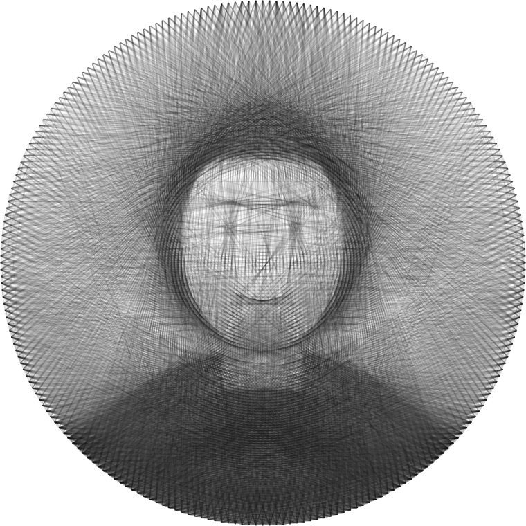

# String Art Studio

<p align="center">
  
</p>
<p align="center">
  <em>4,000 chords &middot; 240 nails &middot; one continuous thread</em>
</p>

Turn a photograph into a **threading sequence** &mdash; the ordered list of nails you wrap a
single continuous string around, on a circular board, so that the overlapping chords
reproduce the image.

Everything runs in your browser. No build step, no dependencies, no accounts, and no
network calls: your image is never uploaded anywhere.

## Try it

**[&rarr; Open String Art Studio in your browser](https://TrevorPeters0n.github.io/string-art-studio/)**

Nothing to install and nothing to sign up for.

---

## Running it

Three ways, in order of how little effort they take.

### 1. In the browser (any OS)

Use the hosted link above. Forking the repository and turning on GitHub Pages gives you
your own copy at your own URL, since the app is a plain static site.

The hosted version is the full app with two limits: exports arrive as ordinary browser
downloads rather than through a "Save As" dialog, and it is capped by a browser tab's
memory, which puts the very top of the nail and resolution sliders out of reach.

### 2. Locally from the source (any OS)

```
git clone https://github.com/TrevorPeters0n/string-art-studio.git
cd string-art-studio
python serve.py          # or:  node serve.mjs
```

Then open <http://127.0.0.1:8123/>. Python 3 or Node 18+ will do; you do not need both,
and neither one installs anything. On Windows, `start.bat` does the same by double-click.

### 3. As a Windows desktop app

Run `Install-Shortcuts.cmd` once. That adds a Desktop and Start Menu shortcut that opens
the app in its own window &mdash; no tabs, no address bar, its own taskbar icon &mdash; with a
local server starting and stopping behind it automatically.

This part is **Windows and Edge only**. It is a convenience wrapper around the same web
app, not a separate build. `Install-Shortcuts.cmd /remove` takes the shortcuts away again
and leaves the folder untouched.

### Why it needs a server at all

ES modules and Web Workers are blocked on `file://` (opaque origin), so opening
`index.html` directly will not work. The launcher hides that: it picks a free
loopback port, serves the folder with `pythonw` (or `node`) so no console
window appears, waits for the port, and opens Edge in app mode. Closing the
window stops the server. Problems are logged to
`%LOCALAPPDATA%\StringArtStudio\launcher.log`.

### The app icon

The window, taskbar and shortcut icons all come from `icon.ico`, which is
generated by `make_icon.py` (no image libraries needed — run it again if you
want to change the mark). The window icon specifically comes from the page's
favicon rather than from the shortcut, so `index.html` declares it explicitly.

Below 32 px the icon switches to a simplified, heavier version of the same
mark, because fine chords disappear at that size — and the chords deliberately
avoid passing through the centre, since diameters read as a wheel rather than
as string.

If Windows still shows an old icon after a change, that's the Explorer icon
cache; re-running `Install-Shortcuts.cmd` rewrites the shortcuts and usually
clears it.

### Keyboard shortcuts

| Key | Action |
|---|---|
| `G` | Generate |
| `Space` | Pause / resume (while running) |
| `Esc` | Stop (while running) |
| `Ctrl+O` | Open an image |
| `Ctrl+Shift+O` | Open a saved `.json` project |
| `Ctrl+S` | Export PNG |
| `Ctrl+E` | Export the threading sequence |
| `Ctrl+G` | Open the Build Guide |

Inside the Build Guide: `←` `→` or `Space` to move, `Esc` to close.

### What it does and doesn't get from being a desktop app

It **does** get: real "Save As" dialogs that remember the last folder you used
per export type; a window that remembers its size and position between
launches; a much higher memory ceiling than a browser tab (1.6 GB, enough for
the full range of the nail and resolution sliders); and reopening saved
projects from inside the app.

It **doesn't** get true OS file association — double-clicking a `.json` project
in Explorer will not open it here, because the app runs inside a browser engine
rather than a native shell. Use **Open saved project** in the sidebar (or
`Ctrl+Shift+O`, or drag the `.json` onto the window) instead. Real file
association would need an Electron or Tauri build.

---

## How the algorithm works

**The physical idea.** Nails sit evenly around the rim of a circular board. A single
thread runs from nail to nail in straight lines (chords). Any one pass of thread is
nearly transparent, but where many chords cross, the board reads as dark. Tone comes
from *chord density*, not from ink.

**The search.** Choosing the globally optimal set of chords is intractable, so this
uses the standard greedy approach (popularised by Petros Vrellis): start at a nail,
look at every chord you could draw from it, take the best one, and repeat.

What makes the result good is how "best" is scored. This app tracks a floating-point
simulation of the board (`cur`) against the target image (`tgt`), and for each pixel a
candidate chord would cover computes:

```
d    = cur - tgt                                  current signed error
u    = alpha x coverage x (cur - threadColour)    what this pass would remove
gain = d² - (d - u)²  =  u x (2d - u)
```

Summing `gain` along the chord gives the **exact reduction in squared error** from
laying that thread. The chord with the highest total wins, gets blended into `cur`,
and becomes the new current nail.

Scoring this way rather than "sum the darkness underneath" buys three things:

- **It self-limits.** Once a region already matches the target, more thread there
  scores negative, so the algorithm stops piling on and moves elsewhere. Naive
  darkness-summing keeps darkening until it runs out of lines.
- **It is direction-agnostic.** White thread on a black board works with no changes,
  because the score only cares about moving `cur` toward `tgt`.
- **It extends to colour** by summing the same expression over R, G and B.

**Anti-aliasing.** Chords are rasterised with Xiaolin Wu's algorithm, so a chord
contributes fractional coverage to the two pixels it straddles. Without this, scores
jitter with the exact pixel grid and the output is visibly rougher.

**Speed.** Every one of the ½·N·(N−1) possible chords is rasterised once at startup
into three flat typed arrays (`offsets`, `pixelIndex`, `coverage`). After that, scoring
a candidate is a tight loop over a contiguous slice — no geometry per step. The cache
is keyed by nail count, resolution and rotation, so re-running with only the thread
settings changed skips the rebuild. At 240 nails / 500 px that is ~79 MB and about
4 seconds for 5000 lines.

**Guards against degenerate paths.**

| Control | What it does |
|---|---|
| Min. nail gap | Forbids chords between nails that are too close, which otherwise win on cheap short lines and pile up on the rim |
| Repeat penalty | Down-ranks a chord each time it has already been used, spreading coverage out |
| Long-line bias | `gain` naturally grows with chord length. Positive values lean further into long sweeping chords, negative values normalise toward per-pixel quality and favour local detail |
| Stop early | Ends a colour as soon as no chord improves the image, rather than padding to the requested count |

---

## Using it

1. **Load an image** — drop a file, click to browse, paste with `Ctrl+V`, or pick one of
   the three built-in samples.
2. **Frame it.** Drag the thumbnail to pan, scroll to zoom, and use the rotate/mirror
   controls. Only what lands inside the circle is used.
3. **Adjust tone.** Faces usually want a contrast bump and a little detail boost.
   *Auto levels* stretches the histogram to the full range and is a good first move.
   *Edge fade* softens the rim, which hides the hard circular cut-off.
4. **Set the board.** Nail count and real-world diameter. The panel warns you when
   nails end up closer than about 2.5 mm, which is hard to drill cleanly.
5. **Set the threads.** Colour, line count, and opacity per thread. Threads are worked
   in order — one continuous strand per colour, the way you would actually build it.
6. **Generate**, then watch it draw. Pause, resume or stop at any point; stopping still
   gives you a complete, usable sequence.
7. **Export**, and open the **Build Guide** to thread it.

### Choosing thread settings

Opacity is how dark a single pass of thread reads, as a fraction. It is the parameter
that most affects the look:

- **Too high** — the image goes blotchy, the algorithm satisfies each region in a few
  chords and stops early.
- **Too low** — nothing is dark enough and you burn lines on no visible effect.

Lower opacity with more lines is always smoother, at the cost of build time. Measured
on the built-in portrait sample (correlation against the source):

| Lines | Opacity | Match | Correlation |
|---|---|---|---|
| 3000 | 0.15 | 91.8% | 0.82 |
| 3000 | 0.09 | 87.6% | 0.84 |
| 5000 | 0.09 | 92.8% | 0.86 |
| 5000 | 0.06 | 89.7% | 0.87 |

The defaults (4000 lines at 0.10) sit deliberately in the middle. For a real build,
remember the honest cost: at roughly 3.5 seconds per line, 4000 lines is about four
hours of threading.

### What string art cannot do

Every chord crosses the entire board, so darkening one region always lays thread
across everything between it and the rim. Large flat mid-tone areas therefore come out
noisier than the source, and fine detail smaller than the nail spacing cannot be
resolved. High-contrast subjects with a clear silhouette work best.

---

## Exports

| Export | What it is |
|---|---|
| **PNG** | 2000 px render of the result |
| **SVG** | Vector version — one `<line>` per chord, so crossings accumulate correctly |
| **Sequence .txt** | Human-readable instructions in rows of ten, with materials summary |
| **.csv** | One row per step: `step, thread, colour, from_nail, to_nail` |
| **.json** | Full machine-readable record — board, stats, settings and every path |
| **Nail template** | True-scale SVG drilling guide in millimetres |
| **Copy sequence** | Plain nail list to the clipboard |

**Reopening a project.** The `.json` export is a complete record — board,
settings, stats and every thread path. Load it back with **Open saved project**
to restore the preview, the stats and the Build Guide without recomputing, which
is the quick way to pick a build back up days later.

**Printing the template.** It is sized in real millimetres, so print at **100% scale**
(not "fit to page") and check the 100 mm bar with a ruler before drilling. Boards
larger than A4 need poster/tiled printing — the template prints the exact rim spacing
on it so you can step the nails out with dividers instead.

---

## Build Guide

The button in the header opens a full-screen stepper for when you are at the board
with thread in hand:

- The current move shown large — *from nail 42, around nail 187*
- A live map with the current chord highlighted and the thread so far behind it
- Next / Prev, a scrub slider, jump-to-step, and optional auto-advance
- Arrow keys and space to advance, Escape to close
- The next twelve moves listed, so you can read ahead
- **Your position is saved automatically** and restored when you reopen the same
  result — you can close the tab mid-build and pick up where you left off

---

## Files

```
index.html              layout
css/style.css           styling, light and dark
js/app.js               UI wiring, worker lifecycle, settings persistence
js/stringart.worker.js  the solver — chord cache and greedy search
js/imageEditor.js       framing, tonal adjustments, target buffer
js/render.js            canvas rendering of the thread path
js/exporters.js         PNG / SVG / TXT / CSV / JSON / nail template
js/guide.js             step-by-step build guide
js/samples.js           procedurally drawn sample images
js/util.js              geometry, colour, formatting helpers
serve.py, serve.mjs     local static servers
icon.ico, icon-*.png    app icon (favicon + shortcut + taskbar)
make_icon.py            regenerates the icon set, standard library only
manifest.webmanifest    app name and icons for the window
Launch.vbs              silent launcher (what the shortcuts run)
launch.ps1              picks a port, starts the server, opens the app window
Install-Shortcuts.cmd   adds/removes the Desktop and Start Menu shortcuts
start.bat               plain browser-tab fallback
assets/example.png      the image at the top of this file
```

Board settings, thread setup and image adjustments persist in `localStorage`, so the
app comes back the way you left it.

There is no build step and no package manager. The `js/` files are plain ES modules
loaded directly by the browser, so editing one and reloading is the whole dev loop.

---

## Contributing

Issues and pull requests are welcome. A few things worth knowing before changing the
solver:

- `js/stringart.worker.js` is a **classic** worker with no imports, so it can be loaded
  without a module-worker dependency. Keep it self-contained.
- The nail geometry in `nailXY()` is duplicated in `js/util.js` and in the worker. The
  two must stay identical or the render will not line up with what the solver computed.
- Chords must be stroked **one at a time**. Batching them into a single path composites
  the whole polyline once, so crossings stop accumulating darkness &mdash; which is the
  entire effect string art depends on.

## Credits

The greedy chord approach was popularised by **Petros Vrellis**, whose 2016 *A new way to
knit* series is what most implementations of this idea trace back to. The squared-error
scoring, the anti-aliased chord cache and everything else here were written from scratch.

Sample images are drawn procedurally at runtime, so the repository ships no third-party
image assets.

## License

[MIT](LICENSE) &mdash; free to use, modify, and redistribute, including commercially. If you
build something with it, a link back is appreciated but not required.
